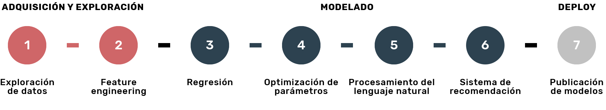

# Acamica
Hoy en día tenemos la capacidad de producir y almacenar infinitas cantidades de información de distintas fuentes. Sea en fotos, reportes de ventas o códigos de ADN, el dilema es ¿cómo usamos esa gigante cantidad de datos para crear impacto?

En esta carrera vas a adquirir los skills necesarios para recopilar, procesar y analizar datos para luego interpretarlos y realizar predicciones automáticas de forma inteligente.

### En 6 meses vas a aprender:

#### Machine Learning
que tiene sus cimientos en la inteligencia artificial, nos permite predecir comportamientos futuros a través de la identificación de patrones complejos.

#### NLP
El procesamiento de lenguaje natural es la base para el análisis del lenguaje humano. Se utiliza por ejemplo en el desarrollo de asistentes de voz como Siri o Alexa.

 #### Clustering
Es la lógica que nos permite separar datos en grupos de forma automatizada según relaciones entre ellos. Esto representa una parte de lo que hoy conocemos como inteligencia artificial.

#### Deep Learning
Modelos computacionales que nos permiten procesar datos en varias capas y usar el resultado como input para futuros procesos. Esto nos permite tener autos autocomandados o Inteligencia Artificial en juegos.

#### Cloud A.I.
Saber manejar las herramientas cloud como Watson de IBM te va a dar acceso a computadoras de alto poder de procesamiento y modelos de la inteligencia artificial ya programados para utilizar en tus proyectos.

#### Deployment
Además de correr tus algoritmos, vas a poder crear productos sobre ellos y publicarlos para que otros usuarios puedan usarlos.

La carrera cuenta con 4 proyectos divididos en 7 entregas. A lo largo de estas entregas iremos recorriendo el workflow típico de data science, formado por las etapas adquisición y exploración de datos, modelado y deploy, como se muestra a continuación:

